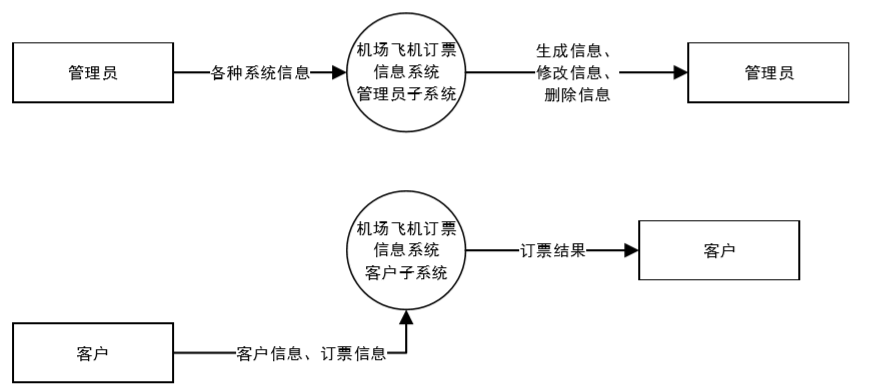
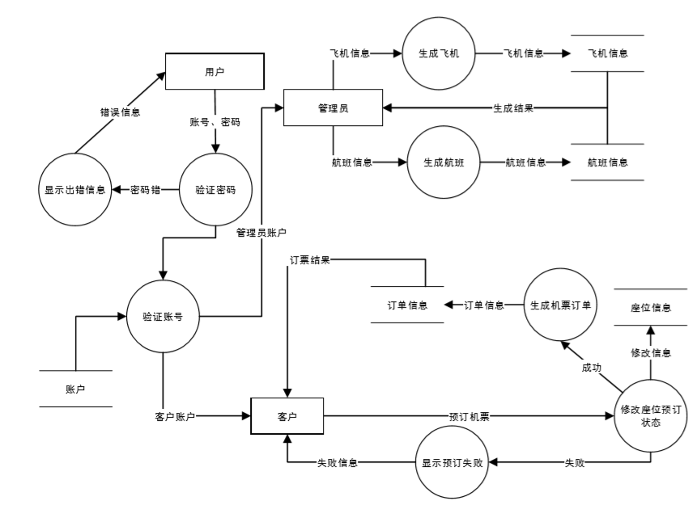

#选题
## 选题
基于B/S结构风格的Web应用，有数据存储功能。
做一个机场飞机售票信息系统。

#需求分析

## use case

### 管理员模块

### 客户模块

## 数据流图
###系统级数据流图

### 系统功能级数据流图

## 数据字典
###"管理航班信息"用例

|||
|:---|-:-|
|用例编号|01|
|用例名|查询航班信息|
|用例描述|客户、管理员进入航班信息查询界面，查询航班信息。|
|参与者|客户、管理员|
|前置条件|系统的航班查询页面正常运行|
|后置条件|显示航班信息|
|主事件流|<ol><li>客户、管理员选中查询航班的菜单项</li><li>输入想要查询的航班的起始地信息、目的地信息</li><li>根据输入的起始地和目的地，在数据库中搜索匹配的航班信息如：航空公司名，航班号，起飞时间，剩余座位数，票价等。</li><li>将搜索到的航班信息显示在请求者的页面。</li></ol>|
|备选事件流|<ul><li>3a.输入的起始地或目的地为空<ol><li>系统提示起始地和目的地不能为空，并拒绝搜索输入航班信息;</li><li>客户、管理员离开或重新输入起始地和目的地。.</li> </ol></li></ul><ul><li>3b.输入起始地或目的地不存在数据库<ol><li>系统提示输入的目的地与起始地不存在于数据库,并拒绝搜索输入航班信息.</li> <li>客户、管理员离开或重新输入目的地与起始地。</ol></li></ul>|

###"增加航班信息"用例
<table><tr><td> 用例编号</td><td> 02</td></tr>
<tr><td>用例名</td><td> 增加航班信息</td></tr>
<tr><td> 用例描述</td><td> 管理员进入航班信息新增界面,增加新的航班信息</td></tr>
<tr><td> 参与者</td><td> 管理员</td></tr>
<tr><td> 前置条件</td><td> 系统的管理员新增航班页面正常运行</td></tr>
<tr><td> 后置条件</td><td> 存储新增航班信息</td></tr>
<tr><td> 主事件流</td><td><ol>
<li>管理员进入系统的管理员新增航班页面；
<li>管理员输入需要新增航班的航空公司号、航班号、起始地、目的地、起飞时间、一等座座位数及价格、二等座座位数及价格、三等座座位数及价格；
<li> 管理员提交更新信息；
<li> 系统对用户提交的航空公司号、航班号、起始地、目的地进行有效性检查；
<li> 检查通过，系统显示新增信息成功。
</ol></td></tr><tr><td>备选事件流</td><td><ul>
<li>4a. 管理员输入要注册的航空公司号或航班号为空或已被注册
	1. 系统提示航空公司号或航班号不能为空或用户名已被注册，并拒绝接收输入用户信息
	2. 管理员离开或重新输入航空公司号或航班号。
<li>4b. 管理员输入的起始地或目的地为空
	1. 系统提示请输入起始地和目的地，并拒绝接收输入用户信息
	2. 管理员离开或重新输入起始地和目的地
<li>4c. 管理员输入起始地和目的地一致
	1. 系统提示起始地和目的地不能一致，请重新输入，并拒绝接收输入用户信息
    2. 用户离开或重新输入起始地和目的地
</ul></td></tr></table>

###"修改航班信息"用例
<table><tr><td> 用例编号</td><td> 03</td></tr>
<tr><td>用例名</td><td> 修改航班信息</td></tr>
<tr><td> 用例描述</td><td> 管理员进入航班信息修改界面,修改系统中已有航班信息</td></tr>
<tr><td> 参与者</td><td> 管理员</td></tr>
<tr><td> 前置条件</td><td> 系统的管理员新增航班页面正常运行，管理员已经在查询航班信息的显示页面</td></tr>
<tr><td> 后置条件</td><td> 更新被修改的航班信息</td></tr>
<tr><td> 主事件流</td><td><ol>
<li>管理员进入系统的所要修改的航班的信息页面；
<li>点击修改航班按钮
<li>管理员输入需要更新航班的航空公司号、航班号、起始地、目的地、起飞时间、一等座座位数及价格、二等座座位数及价格、三等座座位数及价格；
<li> 管理员提交新增信息；
<li> 系统对用户提交的航空公司号、航班号、起始地、目的地进行有效性检查；
<li> 检查通过，系统显示新增信息成功。
</ol></td></tr><tr><td>备选事件流</td><td><ul>
<li>4a. 管理员输入要注册的航空公司号或航班号为空或已被注册
	1. 系统提示航空公司号或航班号不能为空或用户名已被注册，并拒绝接收输入用户信息
	2. 管理员离开或重新输入航空公司号或航班号。
<li>4b. 管理员输入的起始地或目的地为空
	1. 系统提示请输入起始地和目的地，并拒绝接收输入用户信息
	2. 管理员离开或重新输入起始地和目的地
<li>4c. 管理员输入起始地和目的地一致
	1. 系统提示起始地和目的地不能一致，请重新输入，并拒绝接收输入用户信息
    2. 用户离开或重新输入起始地和目的地
</ul></td></tr></table>

###"删除航班信息"用例
<table><tr><td> 用例编号</td><td> 04</td></tr>
<tr><td>用例名</td><td> 删除航班信息</td></tr>
<tr><td> 用例描述</td><td> 管理员进入航班信息删除界面,修改系统中已有航班信息</td></tr>
<tr><td> 参与者</td><td> 管理员</td></tr>
<tr><td> 前置条件</td><td> 系统的管理员删除航班页面正常运行，管理员已经在查询航班信息的显示页面</td></tr>
<tr><td> 后置条件</td><td> 删除航班信息</td></tr>
<tr><td> 主事件流</td><td><ol>
<li>管理员进入系统的所要删除的航班的信息页面；
<li>管理员点击删除按钮
<li>管理员点击再次删除按钮
<li>系统拒绝接收来自该航班的修改、订票等操作
<li>系统为已订购该航班的客户退票
<li>系统在数据库中删除与该航班相关的信息
<li>系统显示航班删除成功。
</ol></td></tr><tr><td>备选事件流</td><td><ul>
<li>3a. 管理员没有点击再次删除
	1. 系统提示取消对该航班的删除操作
	2. 管理员离开或重新点击删除按钮。
</ul></td></tr></table>

###"查询客户信息"用例
<table><tr><td> 用例编号</td><td> 05</td></tr>
<tr><td>用例名</td><td> 查询客户信息</td></tr>
<tr><td> 用例描述</td><td> 管理员进入客户信息管理界面,</td></tr>
<tr><td> 参与者</td><td> 管理员</td></tr>
<tr><td> 前置条件</td><td> 系统的管理员客户信息管理页面正常运行</td></tr>
<tr><td> 后置条件</td><td> 显示查询的客户信息</td></tr>
<tr><td> 主事件流</td><td><ol>
<li>管理员进入系统的客户信息管理页面；
<li>管理员选择查询所有客户、或者输入想要查询的客户的身份信息
<li> 管理员提交查询操作；
<li> 系统对用户提交的信息进行有效性检查；
<li> 检查通过，系统显示查询客户的相关信息。
</ol></td></tr><tr><td>备选事件流</td><td><ul>
<li>4a. 管理员输入的客户身份信息为空或未被注册
	1. 系统提示身份信息不能为空或用户名未被注册，并拒绝查询客户信息操作
	2. 管理员离开或进行全局查询或者重新输入所需查询的客户身份信息。
</ul></td></tr></table>

###"增加客户信息"用例
<table><tr><td> 用例编号</td><td> 06</td></tr>
<tr><td>用例名</td><td> 增加客户信息</td></tr>
<tr><td> 用例描述</td><td> 管理员进入客户信息新增界面,</td></tr>
<tr><td> 参与者</td><td> 管理员</td></tr>
<tr><td> 前置条件</td><td> 系统的管理员新增客户信息页面正常运行</td></tr>
<tr><td> 后置条件</td><td> 存储新增客户信息</td></tr>
<tr><td> 主事件流</td><td><ol>
<li>管理员进入系统的管理员新增客户页面；
<li>管理员输入需要新增客户的身份信息；
<li> 管理员提交新增信息；
<li> 系统对用户提交的客户信息进行有效性检查；
<li> 检查通过，系统显示新增信息成功。
</ol></td></tr><tr><td>备选事件流</td><td><ul>
<li>4a. 管理员输入要新增的客户信息为空或已被注册
	1. 系统提示客户信息不能为空或已被注册，并拒绝接收输入客户信息
	2. 管理员离开或重新输入客户信息。
</ul></td></tr></table>

###"修改客户信息"用例
<table><tr><td> 用例编号</td><td> 07</td></tr>
<tr><td>用例名</td><td> 修改客户信息</td></tr>
<tr><td> 用例描述</td><td> 管理员进入客户信息修改界面,修改系统中已有客户信息</td></tr>
<tr><td> 参与者</td><td> 管理员</td></tr>
<tr><td> 前置条件</td><td> 系统的管理员客户信息修改页面正常运行，管理员已经在查询客户信息的显示页面</td></tr>
<tr><td> 后置条件</td><td> 更新被修改的客户信息</td></tr>
<tr><td> 主事件流</td><td><ol>
<li>管理员进入系统的所要修改的客户的信息页面；
<li>点击修改客户信息按钮
<li>管理员输入需要更新的客户身份信息；
<li> 管理员提交更新信息；
<li> 系统对用户提交的客户信息进行有效性检查；
<li> 检查通过，系统显示更新信息成功。
</ol></td></tr><tr><td>备选事件流</td><td><ul>
<li>4a. 管理员输入要更新的客户信息为空或已被注册
	1. 系统提示客户信息不能为空或已被注册，并拒绝接收输入客户信息
	2. 管理员离开或重新输入客户信息。
</ul></td></tr></table>

###"删除客户信息"用例
<table><tr><td> 用例编号</td><td> 08</td></tr>
<tr><td>用例名</td><td> 删除客户信息</td></tr>
<tr><td> 用例描述</td><td> 管理员进入客户信息删除界面,修改系统中已有客户信息</td></tr>
<tr><td> 参与者</td><td> 管理员</td></tr>
<tr><td> 前置条件</td><td> 系统的管理员删除客户页面正常运行，管理员已经在查询客户信息的显示页面</td></tr>
<tr><td> 后置条件</td><td> 删除数据库中客户信息</td></tr>
<tr><td> 主事件流</td><td><ol>
<li>管理员进入系统的所要删除的客户的信息页面；
<li>管理员点击删除按钮
<li>管理员点击再次删除按钮
<li>系统检查所删除客户是否无订票。
<li>检查通过，系统在数据库中删除与该客户相关的信息
<li>系统显示客户删除成功。
</ol></td></tr><tr><td>备选事件流</td><td><ul>
<li>3a. 管理员没有点击再次删除
	1. 系统显示取消对该客户的删除操作
	2. 管理员离开或重新点击删除按钮。
<li>4a. 该客户存在订票业务
	1. 系统提示该客户存在订票记录，取消对该客户的删除操作，请先行取消订票信息。
	2. 管理员离开。
</ul></td></tr></table>

###"查询订票信息"用例
<table><tr><td> 用例编号</td><td> 09</td></tr>
<tr><td>用例名</td><td> 查询订票信息</td></tr>
<tr><td> 用例描述</td><td> 管理员进入订票信息管理界面,</td></tr>
<tr><td> 参与者</td><td> 管理员</td></tr>
<tr><td> 前置条件</td><td> 系统的管理员订票信息管理页面正常运行</td></tr>
<tr><td> 后置条件</td><td> 显示查询的订票信息</td></tr>
<tr><td> 主事件流</td><td><ol>
<li>管理员进入系统的订票信息管理页面；
<li>管理员选择查询所有订票、或者输入想要查询的订票的筛选信息
<li> 管理员提交查询操作；
<li> 系统对用户提交的信息进行有效性检查；
<li> 检查通过，系统显示查询订票的相关信息。
</ol></td></tr><tr><td>备选事件流</td><td><ul>
<li>4a. 管理员输入的订票筛选信息为空或未被创建
	1. 系统提示身份信息不能为空或用户名未被注册，并拒绝查询订票信息操作
	2. 管理员离开或进行全局查询或者重新输入所需查询的订票筛选信息。
</ul></td></tr></table>

###"增加订票信息"用例
<table><tr><td> 用例编号</td><td> 10</td></tr>
<tr><td>用例名</td><td> 增加订票信息</td></tr>
<tr><td> 用例描述</td><td> 管理员进入订票信息新增界面,</td></tr>
<tr><td> 参与者</td><td> 管理员</td></tr>
<tr><td> 前置条件</td><td> 系统的管理员新增订票信息页面正常运行</td></tr>
<tr><td> 后置条件</td><td> 存储新增订票信息</td></tr>
<tr><td> 主事件流</td><td><ol>
<li>管理员进入系统的管理员新增订票页面；
<li>管理员输入需要新增订票的详细信息；
<li> 管理员提交新增信息；
<li> 系统对用户提交的订票信息进行有效性检查；
<li> 检查通过，系统显示新增信息成功。
</ol></td></tr><tr><td>备选事件流</td><td><ul>
<li>4a. 管理员输入要新增的订票信息为空或已被创建
	1. 系统提示订票信息不能为空或已被创建，并拒绝接收输入订票信息
	2. 管理员离开或重新输入订票信息。
</ul></td></tr></table>

###"修改订票信息"用例
<table><tr><td> 用例编号</td><td> 11</td></tr>
<tr><td>用例名</td><td> 修改订票信息</td></tr>
<tr><td> 用例描述</td><td> 管理员进入订票信息修改界面,修改系统中已有订票信息</td></tr>
<tr><td> 参与者</td><td> 管理员</td></tr>
<tr><td> 前置条件</td><td> 系统的管理员订票信息修改页面正常运行，管理员已经在查询订票信息的显示页面</td></tr>
<tr><td> 后置条件</td><td> 更新被修改的订票信息</td></tr>
<tr><td> 主事件流</td><td><ol>
<li>管理员进入系统的所要修改的订票信息页面；
<li>点击修改订票信息按钮
<li>管理员输入需要更新的订票身份信息；
<li> 管理员提交更新信息；
<li> 系统对用户提交的订票信息进行有效性检查；
<li> 检查通过，系统显示更新信息成功。
</ol></td></tr><tr><td>备选事件流</td><td><ul>
<li>4a. 管理员输入要更新的订票信息为空或已被创建
	1. 系统提示订票信息不能为空或已被创建，并拒绝接收输入订票信息
	2. 管理员离开或重新输入订票信息。
</ul></td></tr></table>

###"删除订票信息"用例
<table><tr><td> 用例编号</td><td> 12</td></tr>
<tr><td>用例名</td><td> 删除订票信息</td></tr>
<tr><td> 用例描述</td><td> 管理员进入订票信息删除界面,修改系统中已有订票信息</td></tr>
<tr><td> 参与者</td><td> 管理员</td></tr>
<tr><td> 前置条件</td><td> 系统的管理员删除订票页面正常运行，管理员已经在查询订票信息的显示页面</td></tr>
<tr><td> 后置条件</td><td> 删除数据库中订票信息</td></tr>
<tr><td> 主事件流</td><td><ol>
<li>管理员进入系统的所要删除的订票的信息页面；
<li>管理员点击删除按钮
<li>管理员点击再次删除按钮
<li>系统在数据库中删除与该订票相关的信息
<li>系统显示订票删除成功。
</ol></td></tr><tr><td>备选事件流</td><td><ul>
<li>3a. 管理员没有点击再次删除
	1. 系统显示取消对该订票的删除操作
	2. 管理员离开或重新点击删除按钮。
</ul></td></tr></table>

###"订购机票"用例
<table><tr><td> 用例编号</td><td> 13</td></tr>
<tr><td>用例名</td><td> 订购机票</td></tr>
<tr><td> 用例描述</td><td> 客户进入机票订购页面,订购已经查询到的航班</td></tr>
<tr><td> 参与者</td><td> 客户</td></tr>
<tr><td> 前置条件</td><td> 系统的客户订购机票页面正常运行，客户已经在查询航班信息的显示页面</td></tr>
<tr><td> 后置条件</td><td> 存储订票信息</td></tr>
<tr><td> 主事件流</td><td><ol>
<li>客户进入系统的所要订票的航班信息页面；
<li>客户点击订购机票按钮；
<li> 客户提交订购身份信息、座位信息；
<li> 系统对用户提交的订票信息进行有效性检查；
<li> 检查通过，系统显示订票成功。
</ol></td></tr><tr><td>备选事件流</td><td><ul>
<li>4a. 客户输入的身份信息为空
	1. 系统提示身份信息不能为空，并拒绝接收输入身份信息和座位信息
	2. 客户离开或重新输入身份信息和座位信息。
<li>4b. 客户输入的座位已经售罄。
	1. 系统提示座位已经售罄，请重新选择其他座位，并拒绝接收输入身份信息和座位信息
	2. 客户离开或重新输入身份信息和座位信息。
</ul></td></tr></table>

###"查询个人信息"用例
<table><tr><td> 用例编号</td><td> 14</td></tr>
<tr><td>用例名</td><td> 查询个人信息</td></tr>
<tr><td> 用例描述</td><td> 客户进入个人信息查看页面,查看自己的个人信息</td></tr>
<tr><td> 参与者</td><td> 客户</td></tr>
<tr><td> 前置条件</td><td> 系统的客户个人信息页面正常运行</td></tr>
<tr><td> 后置条件</td><td> 显示个人信息</td></tr>
<tr><td> 主事件流</td><td><ol>
<li>客户选择查询个人信息的菜单项；
<li>系统在数据库中查询客户的个人信息；
<li>系统跳转到客户个人信息界面；
<li>显示客户的个人信息
</ol></td></tr><tr><td>备选事件流</td><td><ul>
无
</ul></td></tr></table>

###"修改个人信息"用例
<table><tr><td> 用例编号</td><td> 15</td></tr>
<tr><td>用例名</td><td> 修改个人信息</td></tr>
<tr><td> 用例描述</td><td> 客户进入个人信息修改页面,修改自己的个人信息</td></tr>
<tr><td> 参与者</td><td> 客户</td></tr>
<tr><td> 前置条件</td><td> 系统的客户个人信息修改页面正常运行，客户已经进入客户个人信息查看界面</td></tr>
<tr><td> 后置条件</td><td> 在数据库修改个人信息</td></tr>
<tr><td> 主事件流</td><td><ol>
<li>客户在个人信息查看界面点击修改信息按钮；
<li>客户输入新的个人信息；
<li>客户提交修改的个人信息；
<li>系统对用户提交的个人信息进行有效性检查；
<li>检查通过，系统向数据库修改客户的个人信息。
</ol></td></tr><tr><td>备选事件流</td><td><ul>
<li>4a. 客户的提交的个人信息为空
	1.系统提示个人信息不能为空，请求重新输入，拒绝接受提交的个人信息；
	2.客户离开或重新输入个人信息；
</ul></td></tr></table>

###"退订机票"用例
<table><tr><td> 用例编号</td><td> 16</td></tr>
<tr><td>用例名</td><td> 退订机票</td></tr>
<tr><td> 用例描述</td><td> 客户进入退订机票页面,取消自己的订票记录</td></tr>
<tr><td> 参与者</td><td> 客户</td></tr>
<tr><td> 前置条件</td><td> 系统的退订页面正常运行，客户已经进入客户订票信息查看界面</td></tr>
<tr><td> 后置条件</td><td> 在数据库删除订票信息</td></tr>
<tr><td> 主事件流</td><td><ol>
<li>客户在订票信息查看界面点击退订机票按钮；
<li>系统要求客户再次确认是否退订机票
<li>系统增加预订航班的空余座位数
<li>系统在数据库中删除客户的订票信息；
</ol></td></tr><tr><td>备选事件流</td><td><ul>
<li>2a. 客户没有点击确认退订机票按钮
	1.系统提示取消对预订机票的退订操作；
	2.客户离开或重新进行退订操作；
</ul></td></tr></table>

# 分页测试
##